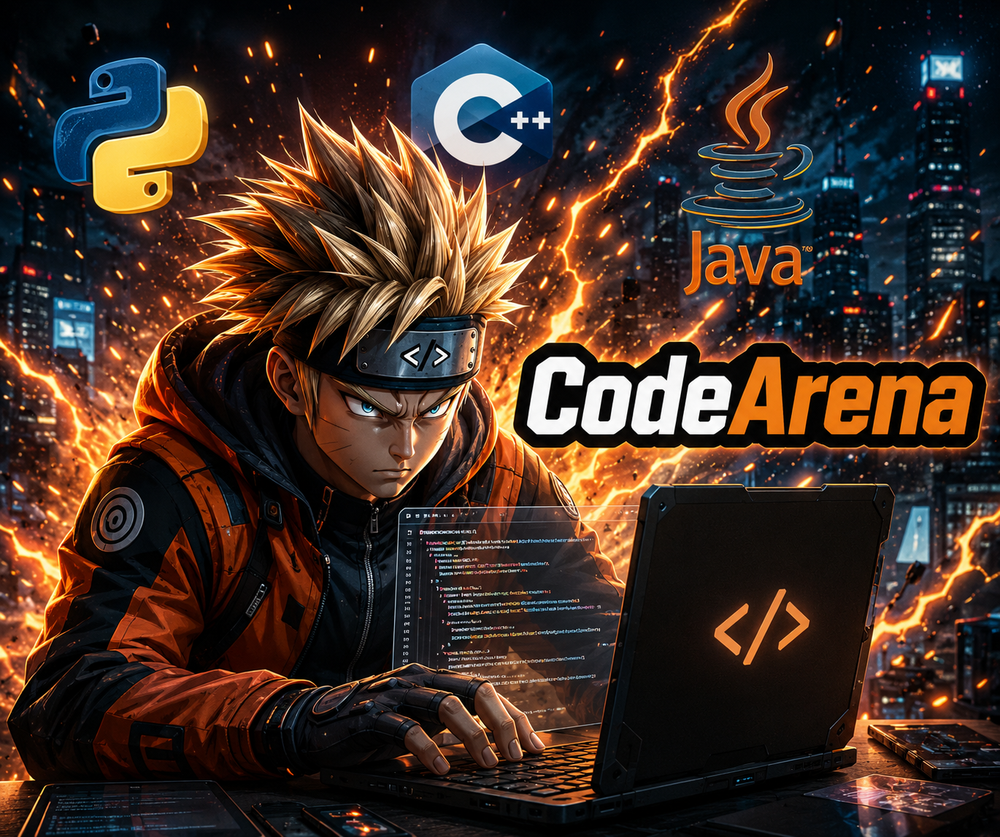

# CodeArena

**CodeArena** is a full-stack, real-time collaborative coding interview platform. Interviewers can spin up a live session, share a coding problem, watch candidates code in a Monaco-powered editor, run their code across multiple languages, and talk face-to-face — all in one browser tab.



---

## ✨ Features

- **Live Coding Sessions** — Create a session around a problem (easy/medium/hard), get a shareable link, and let a participant join in real time.
- **In-Browser Code Editor** — Monaco Editor (the engine behind VS Code) with support for JavaScript, Python, and Java.
- **Code Execution Engine** — Runs candidate code on demand via **Judge0**, with automatic fallback to the **Piston API** if the primary judge is unavailable.
- **Integrated Video Calls** — Host and candidate connect over a live video call powered by **Stream Video**, right inside the session page.
- **Real-Time Chat** — Built-in messaging via **Stream Chat** for async or in-session communication.
- **Authentication** — Secure sign-up/login (including OAuth) handled by **Clerk**.
- **Session Dashboard** — Track active sessions, recent history, and quick stats from a central dashboard.
- **Background Jobs** — **Inngest** handles event-driven background tasks (e.g., notifications).
- **Production-Ready Build** — Single Express server serves the built React app in production.

---

## 🧱 Tech Stack

| Layer | Technology |
|---|---|
| Frontend | React 19, Vite, Tailwind CSS, DaisyUI |
| Editor | Monaco Editor |
| Backend | Node.js, Express 5 |
| Database | MongoDB (Mongoose) |
| Auth | Clerk |
| Realtime Video/Chat | Stream (Video SDK + Chat) |
| Code Execution | Judge0 (primary), Piston (fallback) |
| Background Jobs | Inngest |
| Data Fetching | TanStack Query, Axios |

---

## 🏗️ Architecture

```
CodeArena/
├── backend/                 # Express API
│   └── src/
│       ├── controllers/     # Session & chat business logic
│       ├── models/          # Mongoose schemas (User, Session)
│       ├── routes/          # /api/sessions, /api/chat
│       ├── middleware/      # Clerk route protection
│       ├── lib/              # DB, env, Inngest, Stream setup
│       └── server.js         # App entry point
│
├── frontend/                 # React + Vite client
│   └── src/
│       ├── pages/            # Dashboard, Problems, Session, Problem pages
│       ├── components/       # Editor panel, output panel, video UI, etc.
│       ├── hooks/             # useSessions, useStreamClient
│       ├── lib/               # Axios instance, Stream client, code-runner (Judge0/Piston)
│       └── data/              # Problem set
│
└── package.json               # Root build/start scripts for deployment
```

**Flow:** A host creates a session tied to a problem → a participant joins via session ID → both connect to a Stream video call and chat channel → the candidate writes code in Monaco → code execution requests go out to Judge0 (falling back to Piston) → results appear in an output panel in real time.

---

## 🚀 Getting Started

### Prerequisites

- Node.js (v18+) and npm
- A [MongoDB Atlas](https://www.mongodb.com/atlas) cluster (free tier is fine)
- A [Clerk](https://clerk.com/) account (for auth)
- A [Stream](https://getstream.io/) account (for chat + video)
- An [Inngest](https://www.inngest.com/) account (for background jobs)

### 1. Clone the repo

```bash
git clone https://github.com/Mkn1261/CodeArena.git
cd CodeArena
```

### 2. Set up the backend

```bash
cd backend
npm install
```

Create a `.env` file in `backend/`:

```env
PORT=3000
NODE_ENV=development
DB_URL=<your_mongo_uri>
INNGEST_EVENT_KEY=<your_inngest_event_key>
INNGEST_SIGNING_KEY=<your_inngest_signing_key>
STREAM_API_KEY=<your_stream_api_key>
STREAM_API_SECRET=<your_stream_api_secret>
CLERK_PUBLISHABLE_KEY=<your_clerk_publishable_key>
CLERK_SECRET_KEY=<your_clerk_secret_key>
CLIENT_URL=http://localhost:5173
```

```bash
npm run dev
```

### 3. Set up the frontend

```bash
cd ../frontend
npm install
```

Create a `.env.local` file in `frontend/`:

```env
VITE_CLERK_PUBLISHABLE_KEY=<your_clerk_publishable_key>
VITE_API_URL=http://localhost:3000/api
VITE_STREAM_API_KEY=<your_stream_api_key>
```

```bash
npm run dev
```

### 4. Open the app

Visit **http://localhost:5173** — the backend runs on **http://localhost:3000**.

### Production build

From the project root:

```bash
npm run build   # installs deps for both apps and builds the frontend
npm start        # serves the built frontend from the Express server
```

---

## 📌 Key API Endpoints

| Method | Endpoint | Description |
|---|---|---|
| `POST` | `/api/sessions` | Create a new coding session |
| `GET` | `/api/sessions/active` | List currently active sessions |
| `GET` | `/api/sessions/my-recent` | Get the current user's recent sessions |
| `GET` | `/api/sessions/:id` | Get a session by ID |
| `POST` | `/api/sessions/:id/join` | Join an existing session |
| `POST` | `/api/sessions/:id/end` | End a session |
| `GET` | `/api/chat/token` | Issue a Stream Chat token for the authenticated user |

All routes above (except health check) are protected via Clerk middleware.

---

## 🗺️ Roadmap Ideas

- Support for additional languages in the code runner
- Recorded session playback
- Candidate scoring/feedback rubric tied to each session
- Interviewer notes synced alongside the code editor

---

## 🤝 Contributing

Contributions are welcome! Fork the repo, create a feature branch, and open a pull request.

## 📄 License

ISC
